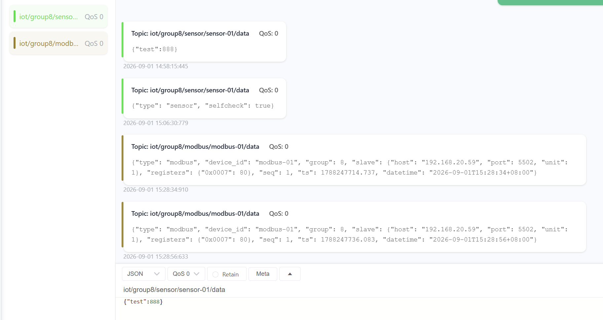
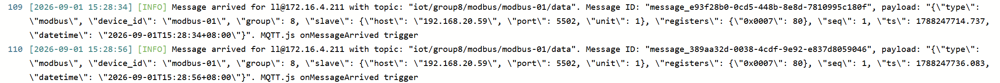

# 终端模拟软件

两个**独立任务**的 Python 实现，共用同一套 MQTT 服务器参数。

| 任务 | 脚本 | 功能 |
| --- | --- | --- |
| 任务 1 | `sensor_simulator.py` | 监视 `sensor.json` 温湿度数值变化 → MQTT 上报 |
| 任务 2 | `modbus_collector.py` | 读 Modbus-TCP 寄存器 → 打包 JSON → MQTT 上报 |

两个脚本互不依赖，可分别单独运行。

## MQTT 服务器（两个任务共用）

- 地址：`172.16.4.211`
- 端口：`9783`

## 环境要求

- Python 3.9+
- 依赖：`pip install -r requirements.txt`（`paho-mqtt`、`pymodbus`）

## 小组配置（第 8 组）

`config.py` 中已设置 `GROUP_ID = 8`。这决定了：

- MQTT 主题前缀：`iot/group8/...`
- Modbus 寄存器区间：第 8 组 → `0x0007`（见下方寄存器分配）

---

## 任务 1：温湿度模拟器（sensor.json + MQTT 上报）

```bash
python sensor_simulator.py
```

运行逻辑：

1. 启动时若 `sensor.json` 不存在，自动生成默认值（`temperature=25.0`、`humidity=50.0`）；
2. 每 2 秒读取一次 `sensor.json`，检测温度/湿度是否变化；
3. 数值变化时立即上报 MQTT。

**测试**：运行后手动编辑项目根目录的 `sensor.json`，改 `temperature` 或 `humidity` 并保存，脚本检测到变化后自动上报。

完整链路：`修改 sensor.json → 脚本检测变化 → MQTT 发布 → MQTTX 收到显示`

---

## 任务 2：Modbus-TCP 采集寄存器，再 MQTT 上报

```bash
python modbus_collector.py                       # 周期采集并上报（值变化时上报）
python modbus_collector.py --read                # 读取一次并上报后退出
python modbus_collector.py --write 0x0007 100    # 向本组寄存器写入数值
```

运行逻辑：用 pymodbus 读取从站 `192.168.20.59:5502` 的保持寄存器（本组为 `0x0007`），
打包成 JSON 上报到 MQTT。

完整链路：`pymodbus 读寄存器 → 组装 JSON → MQTT 发布 → MQTTX 收到显示`

---

## 寄存器分配（任务 2）

从站保持寄存器共 `0x0000 ~ 0x0009`（10 个），每组 1 个：

| 小组 | 寄存器 |
| --- | --- |
| 1 | 0x0000 |
| 2 | 0x0001 |
| 3 | 0x0002 |
| 4 | 0x0003 |
| 5 | 0x0004 |
| 6 | 0x0005 |
| 7 | 0x0006 |
| **8** | **0x0007** |
| 备用 | 0x0008、0x0009 |

程序只读写本组寄存器（第 8 组 = `0x0007`），写其它地址会被拒绝。
若地址不同，改 `config.py` 里的 `REGISTERS_PER_GROUP` 或 `group_register_range`。

---

## MQTT 主题与 Payload

主题（第 8 组）：

```text
iot/group8/sensor/sensor-01/data     # 任务 1 数据
iot/group8/sensor/sensor-01/status   # 任务 1 在线状态（online/offline）
iot/group8/modbus/modbus-01/data     # 任务 2 数据
iot/group8/modbus/modbus-01/status   # 任务 2 在线状态
```

任务 1 Payload：

```json
{"type":"sensor","device_id":"sensor-01","group":8,"temperature":25.6,"humidity":48.2,
 "unit":{"temperature":"celsius","humidity":"percentRH"},"seq":3,"ts":1725157680.123,"datetime":"2026-09-01T11:04:17+08:00"}
```

任务 2 Payload：

```json
{"type":"modbus","device_id":"modbus-01","group":8,
 "slave":{"host":"192.168.20.59","port":5502,"unit":1},
 "registers":{"0x0007":8000},"seq":3,"ts":1725157680.123,"datetime":"2026-09-01T11:04:17+08:00"}
```

---

## 用 MQTTX 测试

1. MQTTX 新建连接：Host `172.16.4.211`、Port `9783`（匿名），点「连接」。
2. 订阅主题：`iot/group8/#`（`#` 通配符，收到 group8 下所有消息）。
3. 测任务 1：运行 `python sensor_simulator.py`，然后手动改 `sensor.json` 的数值，观察 MQTTX 收到上报。
4. 测任务 2：运行 `python modbus_collector.py`，观察寄存器数据上报；再用 `--write` 改值看变化。

## 离线测试任务 2（无真实 Modbus 设备时）

另开终端先启动本地从站模拟器，再把采集器指向本地：

```powershell
# 终端 1：本地从站模拟器
python modbus_slave_sim.py

# 终端 2：采集器连本地从站
$env:MODBUS_HOST="127.0.0.1"
python modbus_collector.py
```
## Experiment Result

MQTTX client subscribes topics and receives JSON payload:


MQTT broker receives message log:

